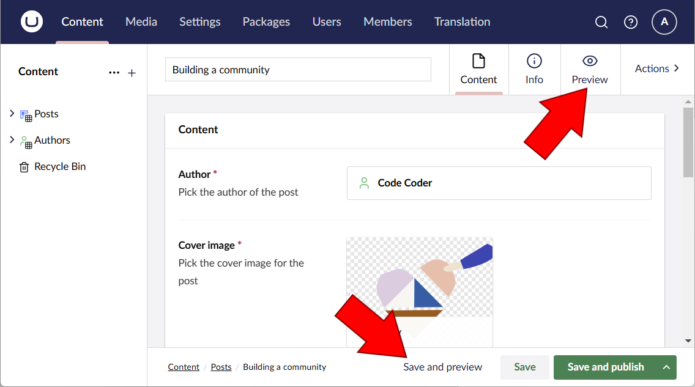
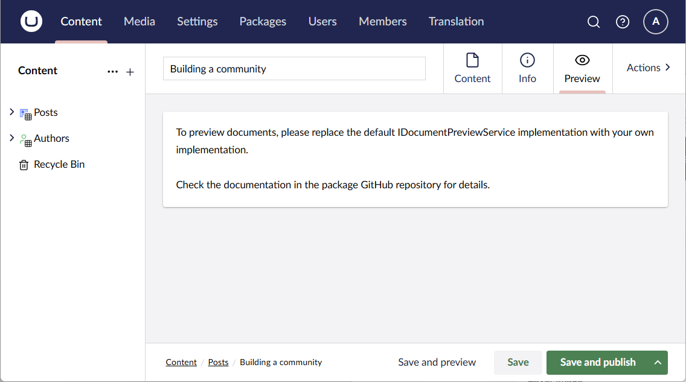
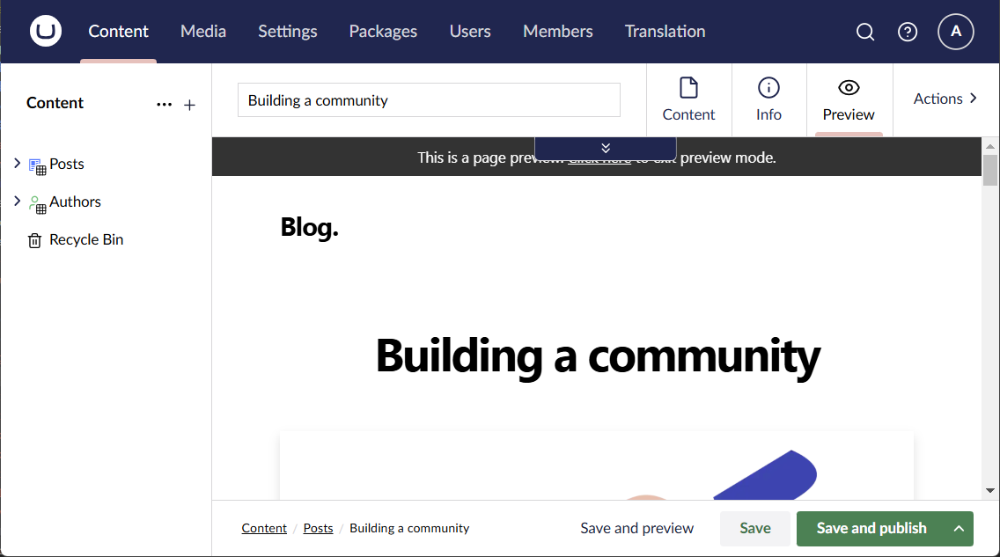
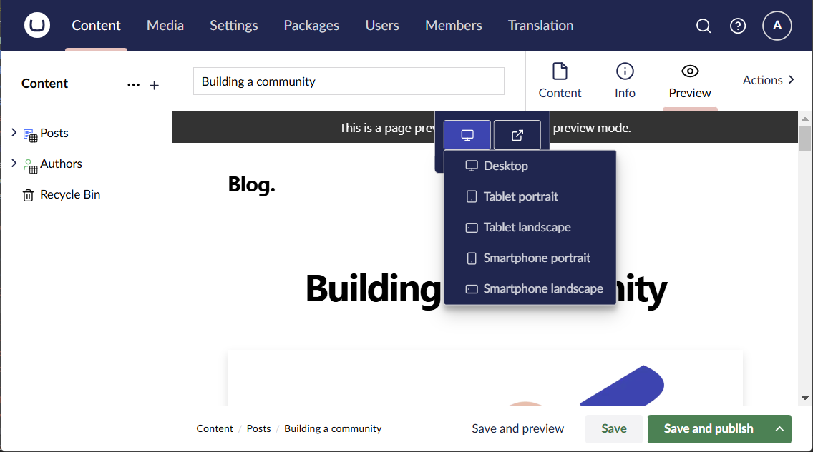

# Back-Office Preview

The Back-Office Preview package offers an alternative to the default preview functionality of Umbraco.

This package has been built specifically for previewing headless sites, where content routing and rendering is not exclusively (or not at all) handled by Umbraco.

## Basic functionality

The package replaces the "Save and preview" button in the document workspace with a custom implementation, and adds a "Preview" view to the workspace as well:



The new "Save and preview" button activates the "Preview" view instead of invoking the default preview functionality.

The "Preview" view is essentially an iframe to contain the preview of your headless site, with a few added bells and whistles. But out of the box, it's not a terribly impressive sight:



This is because the package has no idea where to look for the preview of your headless site - or, in other words, which URL to render in the iframe. And this is where you come in 😊

You need to add an implementation of `IDocumentPreviewService` to your Umbraco site. This interface has two responsibilities:

1. Determine whether a specific document type can be previewed.
   - If a document type does not support preview, the "Save and publish" button and the "Preview" view will be removed from the back-office.
2. Calculate the preview URL of a specific document given the currently active back-office variance (culture and segment).

Here's a sample implementation, using the Next.js Umbraco example as the headless site:

```csharp
using Kjac.BackOfficePreview.Models;
using Kjac.BackOfficePreview.Services;
using Umbraco.Cms.Core.Models;

namespace My.Site.Services;

public class BlogDocumentPreviewService : IDocumentPreviewService
{
    private const string PreviewHost = "https://localhost:3000";
    private const string PreviewSecret = "super-secret-preview-key";
    
    public Task<bool> PreviewSupportedAsync(IContentType documentType)
        // only allow previewing of blog posts for simplicity
        => Task.FromResult(documentType.Alias == "post");

    public Task<DocumentPreviewUrlInfo> PreviewUrlInfoAsync(IContent document, string? culture, string? segment)
    {
        // let's just make sure it's a blog post
        if (document.ContentType.Alias != "post")
        {
            throw new ArgumentException("Only blog posts are supported here", nameof(document));
        }

        return Task.FromResult(new DocumentPreviewUrlInfo
        {
            PreviewUrl = $"{PreviewHost}/api/preview?secret={PreviewSecret}&redirect=/posts/preview-{document.Key}",
        });
    }
}
```

> [!TIP]
> The `DocumentPreviewUrlInfo` allows for specifying textual information for the content editors via the `Info` property.
> 
> This might come in handy in situations where preview makes no sense, for example if the document is missing properties vital for the rendering. Mind you, editors will be previewing draft documents, and Umbraco allows for saving documents with invalid or missing required properties.

> [!NOTE]
> The Next.js Umbraco example doesn't actually support redirects from the preview API, but it can be made to support redirects. That's outside the scope of this documentation, though.

You'll also need a composer to replace the default `IDocumentPreviewService` implementation with your own:

```csharp
using Kjac.BackOfficePreview.Services;
using My.Site.Services;
using Umbraco.Cms.Core.Composing;

namespace My.Site.Composers;

public class Composer : IComposer
{
    public void Compose(IUmbracoBuilder builder)
        => builder.Services.AddUnique<IDocumentPreviewService, BlogDocumentPreviewService>();
}
```

With this in place, and given the blog is running on `https://localhost:3000`, the "Preview" view suddenly becomes useful:



Did you notice the little blue thing in the top of the preview? If you click it, it opens a toolbar with some useful features from the default preview functionality of Umbraco:

- Options for changing the preview viewport.
- A link to open the preview in a new tab (outside the Umbraco workspace).



## Advanced options

The package comes with a few advanced options to improve the editor experience. These are completely optional.

### Retaining scroll position

The preview iframe re-renders when it comes into view. This means that the scroll position of the iframe is lost when flipping back and forth between editing and previewing. This can be quite annoying to work with, particularly when previewing long pages and/or narrow viewports.

The [same-origin policy](https://developer.mozilla.org/en-US/docs/Web/Security/Same-origin_policy) imposes a lot of limitations on what can be done to an iframe, if the embedded URL is not `same-origin`, which is unlikely in the case of previewing a headless site. Manipulating the iframe scroll position is among those limitations.

To work around these limitations, the package features a communication protocol using `window.postMessage()` which allows for retaining the scroll position. To implement the protocol, include a script like this in the preview site:

```js
const umbPreviewMessage = (category, value) => window.parent.postMessage(`umb.preview|${category}|${value}`, "*");

window.onload = () => {
    if (window.parent === window) {
        console.warn('No parent window found, umb.preview is disabled');
        return;
    }

    // tell Umbraco we're ready
    umbPreviewMessage('init', 'ready');
}

window.addEventListener(
        'message',
        (message) => {
           if (typeof message.data === 'string' && message.data.indexOf('umb.preview') === 0) {
              const parts = message.data.split('|');
              if (parts.length === 3 && parts[1] === 'scrollTo') {
                 const coordinates = parts[2].split(',');
                 window.scrollTo(Number(coordinates[0]), Number(coordinates[1]));
              }
           }
        },
        false);

window.addEventListener(
        'scrollend',
        () => umbPreviewMessage('scrollPos', `${window.scrollX},${window.scrollY}`),
        false
);
```

### Click to edit

Another part of the above-mentioned communication protocol enables the editors to click properties within the preview to edit them.

To implement this, first add something like this to the preview site:

```js
const umbPreviewMessage = (category, value) => window.parent.postMessage(`umb.preview|${category}|${value}`, "*");

window.onload = () => {
    if (window.parent === window) {
        console.warn('No parent window found, umb.preview is disabled');
        return;
    }

    const elements = document.querySelectorAll('*[umb-preview-edit]')
    if (!elements.length) {
        // nothing to edit here
        return;
    }

    // this prevents (most) hydration warnings from Next.js
    setTimeout(
        () => {
            const styleSheet = document.createElement('style');
            styleSheet.textContent = `
                .umb-preview-edit:hover {
                    cursor: pointer;
                    box-shadow: inset 0px 0px 0px 2px rgb(27, 38, 79);
                }
            `;
            document.head.appendChild(styleSheet)

            elements.forEach(element => {
                const propertyAlias = element.getAttribute('umb-preview-edit');
                if (!propertyAlias) {
                    // no alias to edit
                    return;
                }
                element.classList.add('umb-preview-edit')
                element.title = `Click to edit this`;
                element.addEventListener('click', () => umbPreviewMessage('edit', propertyAlias));

            });

            // tell Umbraco we're ready
            umbPreviewMessage('init', 'ready');
        },
        500
    )
}
```

> [!IMPORTANT]
> Notice the overlap with the previous example script. A combined script can be found [right here](https://github.com/kjac/Kjac.BackOfficePreview/blob/main/src/Kjac.BackOfficePreview.Site/wwwroot/scripts/umb.preview.js).

Next, add `umb-preview-edit='[property alias]'` attributes to the preview rendering to make the properties clickable - for example:

```tsx
export default function PostHeader({ title, coverImage, date, author }: Props) {
   return (
           <>
              <PostTitle>{title}</PostTitle>
              <div className="hidden md:block md:mb-12" umb-preview-edit="author">
                 <Avatar author={author}/>
              </div>
              <div className="mb-8 md:mb-16 sm:mx-0" umb-preview-edit="coverImage">
                 <CoverImage title={title} coverImage={coverImage}/>
              </div>
              <div className="max-w-2xl mx-auto">
                 <div className="block md:hidden mb-6" umb-preview-edit="author">
                    <Avatar author={author}/>
                 </div>
                 <div className="mb-6 text-lg">
                    <Date dateString={date}/>
                 </div>
              </div>
           </>
   );
}
```

The result is a hover effect around the editable properties. When they're clicked, the editor is taken to the appropriate document type tab in "Content" view:


For your viewing pleasure, here's a screencast that shows it all in action 😉

[Screencast of the package in action](https://github.com/user-attachments/assets/0485936e-a5b0-4527-bf68-74d277a99cc9)

