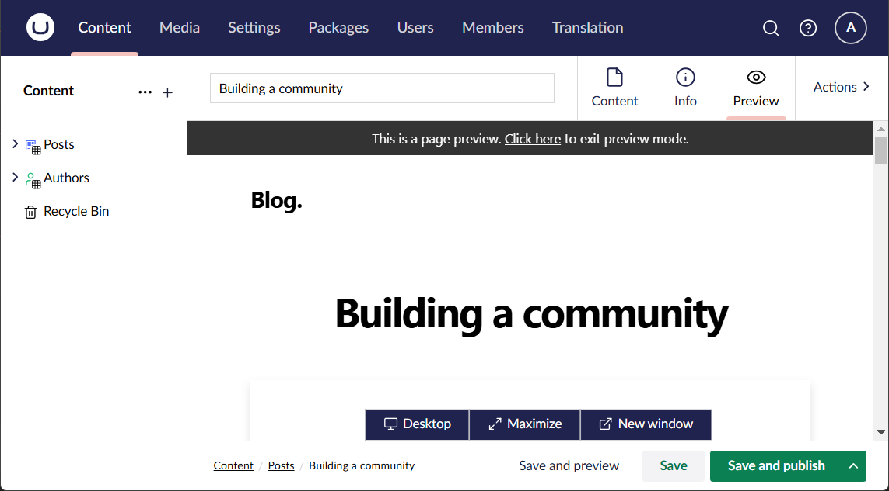
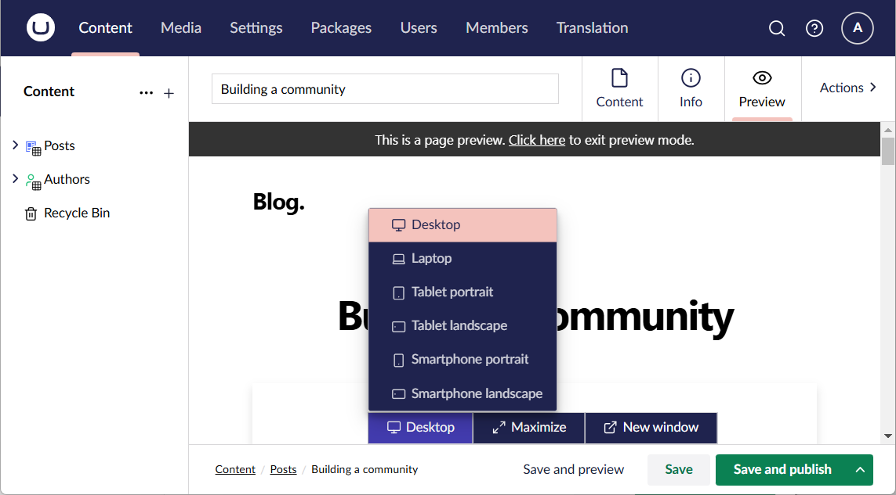
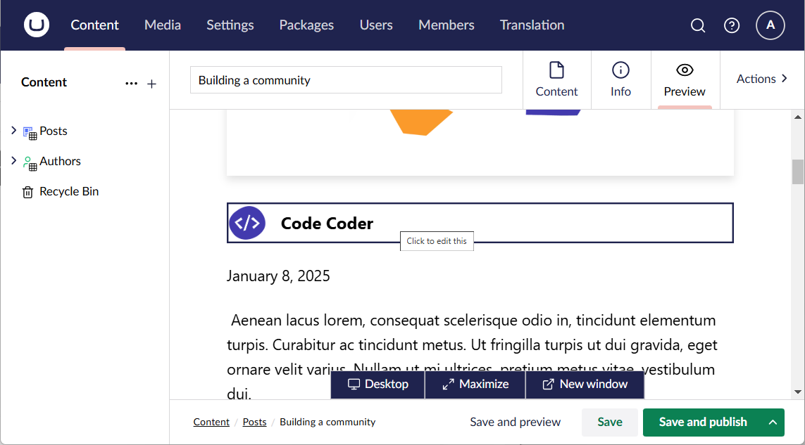

# Headless Preview

The Headless Preview package offers an alternative to the default preview functionality of Umbraco.

This package has been built specifically for previewing headless sites, where content routing and rendering is not exclusively (or not at all) handled by Umbraco.

## Basic functionality

The package replaces the "Save and preview" button in the document workspace with a custom implementation, and adds a "Preview" view to the workspace as well:


The new "Save and preview" button activates the "Preview" view instead of invoking the default preview functionality.

The "Preview" view is essentially an iframe to contain the preview of your headless site, with a few added bells and whistles. But out of the box, it's not a terribly impressive sight:


This is because the package has no idea where to look for the preview of your headless site - or, in other words, which URL to render in the iframe. And this is where you come in 😊

You need to add an implementation of [`IDocumentPreviewService`](https://github.com/kjac/Kjac.HeadlessPreview/blob/main/src/Kjac.HeadlessPreview/Services/IDocumentPreviewService.cs) to your Umbraco site. This interface is responsible for calculating the preview URL of a specific document given the currently active back-office variance (culture and segment).

Here's a sample implementation, using the [Next.js Umbraco blog example](https://github.com/vercel/next.js/tree/canary/examples/cms-umbraco) as the headless site:

```csharp
using Kjac.HeadlessPreview.Models;
using Kjac.HeadlessPreview.Services;
using Umbraco.Cms.Core.Models;

namespace My.Site.Services;

public class BlogDocumentPreviewService : IDocumentPreviewService
{
    private const string PreviewHost = "https://localhost:3000";
    private const string PreviewSecret = "super-secret-preview-key";

    public Task<DocumentPreviewUrlInfo> PreviewUrlInfoAsync(IContent document, string? culture, string? segment)
    {
        // let's just make sure it's a blog post
        if (document.ContentType.Alias != "post")
        {
            throw new ArgumentException("Only blog posts are supported here", nameof(document));
        }

        return Task.FromResult(new DocumentPreviewUrlInfo
        {
            PreviewUrl = $"{PreviewHost}/api/preview?secret={PreviewSecret}&redirect=/posts/preview-{document.Key}",
        });
    }
}
```

> [!TIP]
> The `DocumentPreviewUrlInfo` allows for specifying textual information for the content editors via the `Info` property.
> 
> This might come in handy in situations where preview makes no sense, for example if the document is missing properties vital for the rendering. Mind you, editors will be previewing draft documents, and Umbraco allows for saving documents with invalid or missing required properties.

> [!NOTE]
> The Next.js Umbraco example doesn't actually support redirects from the preview API, but it can be made to support redirects. That's outside the scope of this documentation, though.

You'll also need a composer to replace the default `IDocumentPreviewService` implementation with your own:

```csharp
using Kjac.HeadlessPreview.Services;
using My.Site.Services;
using Umbraco.Cms.Core.Composing;

namespace My.Site.Composers;

public class Composer : IComposer
{
    public void Compose(IUmbracoBuilder builder)
        => builder.Services.AddUnique<IDocumentPreviewService, BlogDocumentPreviewService>();
}
```

With this in place, and given the blog is running on `https://localhost:3000`, the "Preview" view suddenly becomes useful:



The toolbar at the bottom of the screen contains some useful features, some of which originate from the default preview functionality of Umbraco:

- Options for changing the preview viewport.
- An option to maximize the preview to the full size of the browser window.
- A link to open the preview in a new tab (outside the Umbraco workspace).



### Limiting the document types that support previewing

By default, the headless preview is enabled for all document types. However, it's not given that this makes sense in a headless context.

For example, in the Next.js Umbraco blog example, the authors are never rendered os their own entity; they only exist as documents for linkage with the blog posts. As such, authors cannot be previewed. 

You can limit the document types that support previewing by adding a `HeadlessPreview` section to `appsettings.json`:

```json
{
  "$schema": "appsettings-schema.json",
  "HeadlessPreview": {
    "SupportedDocumentTypes": ["post"]
  },
  "Umbraco": {
    "CMS": {
      "DeliveryApi": {
        "Enabled": true,
  // ...
```

If a document type alias is not in the list of `SupportedDocumentTypes`, the "Save and publish" button and the "Preview" view will be removed from the back-office.

> [!NOTE]
> If `SupportedDocumentTypes` is empty, preview will be enabled for all document types. 

If you need to exercise more fine-grained control of the supported document types, you can swap the default behaviour with your own custom logic by implementing the [`IDocumentTypePreviewService`](https://github.com/kjac/Kjac.HeadlessPreview/blob/main/src/Kjac.HeadlessPreview/Services/IDocumentTypePreviewService.cs):

```csharp
using Kjac.HeadlessPreview.Services;
using Umbraco.Cms.Core.Models;

namespace My.Site.Services;

public class MyDocumentTypePreviewService : IDocumentTypePreviewService
{
    public Task<bool> PreviewSupportedAsync(IContentType documentType)
    {
        // add your logic here
    }
}
```

Again, you'll need a composer to replace the default `IDocumentTypePreviewService` implementation with your own:

```csharp
using Kjac.HeadlessPreview.Services;
using My.Site.Services;
using Umbraco.Cms.Core.Composing;

namespace My.Site.Composers;

public class Composer : IComposer
{
    public void Compose(IUmbracoBuilder builder)
        => builder.Services.AddUnique<IDocumentTypePreviewService, MyDocumentTypePreviewService>();
}
```

## Advanced options

The package comes with a few advanced options to improve the editor experience. These are completely optional.

### Retaining scroll position

The preview iframe re-renders when it comes into view. This means that the scroll position of the iframe is lost when flipping back and forth between editing and previewing. This can be quite annoying to work with, particularly when previewing long pages and/or narrow viewports.

The [same-origin policy](https://developer.mozilla.org/en-US/docs/Web/Security/Same-origin_policy) imposes a lot of limitations on what can be done to an iframe when the embedded URL is not `same-origin` (which is likely the case when previewing a headless site). Manipulating the iframe scroll position is among those limitations.

To work around these limitations, the package features a communication protocol using [`window.postMessage()`](https://developer.mozilla.org/en-US/docs/Web/API/Window/postMessage) which allows for retaining the scroll position. To implement the protocol, include a script like this in the preview site:

```js
const umbPreviewMessage = (category, value) => window.parent.postMessage(`umb.preview|${category}|${value}`, "*");

window.onload = () => {
    if (window.parent === window) {
        console.warn('No parent window found, umb.preview is disabled');
        return;
    }

    // tell Umbraco we're ready
    umbPreviewMessage('init', 'ready');
}

window.addEventListener(
        'message',
        (message) => {
           if (typeof message.data === 'string' && message.data.indexOf('umb.preview') === 0) {
              const parts = message.data.split('|');
              if (parts.length === 3 && parts[1] === 'scrollTo') {
                 const coordinates = parts[2].split(',');
                 window.scrollTo(Number(coordinates[0]), Number(coordinates[1]));
              }
           }
        },
        false);

window.addEventListener(
        'scrollend',
        () => umbPreviewMessage('scrollPos', `${window.scrollX},${window.scrollY}`),
        false
);
```

### Click to edit

Another part of the above-mentioned communication protocol enables the editors to click properties within the preview to edit them.

To implement this, first add `umb-preview-edit='[property alias]'` attributes to the preview rendering for the relevant document properties - for example:

```tsx
export default function PostHeader({ title, coverImage, date, author }: Props) {
   return (
           <>
              <PostTitle>{title}</PostTitle>
              <div className="hidden md:block md:mb-12" umb-preview-edit="author">
                 <Avatar author={author}/>
              </div>
              <div className="mb-8 md:mb-16 sm:mx-0" umb-preview-edit="coverImage">
                 <CoverImage title={title} coverImage={coverImage}/>
              </div>
              <div className="max-w-2xl mx-auto">
                 <div className="block md:hidden mb-6" umb-preview-edit="author">
                    <Avatar author={author}/>
                 </div>
                 <div className="mb-6 text-lg">
                    <Date dateString={date}/>
                 </div>
              </div>
           </>
   );
}
```

Next, include a script to wire up the editing - something like this:

```js
const umbPreviewMessage = (category, value) => window.parent.postMessage(`umb.preview|${category}|${value}`, "*");

window.onload = () => {
    if (window.parent === window) {
        console.warn('No parent window found, umb.preview is disabled');
        return;
    }

    const elements = document.querySelectorAll('*[umb-preview-edit]')
    if (!elements.length) {
        // nothing to edit here
        return;
    }

    // this prevents (most) hydration warnings from Next.js
    setTimeout(
        () => {
            const styleSheet = document.createElement('style');
            styleSheet.textContent = `
                .umb-preview-edit:hover {
                    cursor: pointer;
                    box-shadow: inset 0px 0px 0px 2px rgb(27, 38, 79);
                }
            `;
            document.head.appendChild(styleSheet)

            elements.forEach(element => {
                const propertyAlias = element.getAttribute('umb-preview-edit');
                if (!propertyAlias) {
                    // no alias to edit
                    return;
                }
                element.classList.add('umb-preview-edit')
                element.title = `Click to edit this`;
                element.addEventListener('click', () => umbPreviewMessage('edit', propertyAlias));

            });

            // tell Umbraco we're ready
            umbPreviewMessage('init', 'ready');
        },
        500
    )
}
```

> [!IMPORTANT]
> Notice the overlap with the previous example script. A combined script can be found [right here](https://github.com/kjac/Kjac.HeadlessPreview/blob/main/src/Kjac.HeadlessPreview.Site/wwwroot/scripts/umb.preview.js).

The result is a hover effect around the editable properties. When they're clicked, the editor is sent to the "Content" view:



> [!NOTE]
> If the document type uses tabs to group properties together, the tab containing the clicked property will be activated automatically.

For your viewing pleasure, here's a screencast that shows it all in action 😉

[Screencast of the package in action](https://github.com/user-attachments/assets/ba56be63-688b-4fb0-8a0d-491cbd405b79)
